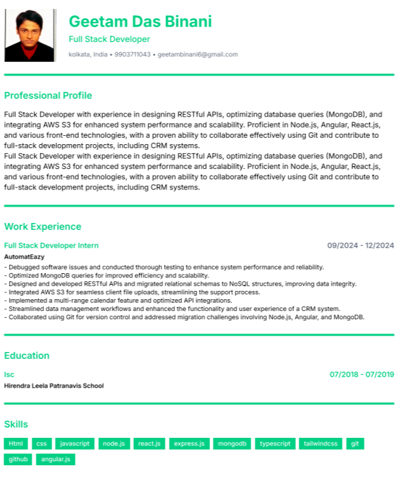

# AI Resume Builder

AI Resume Builder is a modern, feature-rich application that helps users create professional resumes with the assistance of AI. Built with Next.js, TypeScript, and integrated with Google's Gemini AI, this application streamlines the resume creation process and helps users land their dream jobs.



## Features

### Core Features
- **User-friendly Resume Editor**: Step-by-step interface to create and customize your resume
- **Auto-save Functionality**: Your progress is automatically saved as you work
- **Resume Preview**: Real-time preview of your resume as you build it
- **Multiple Resume Management**: Create and manage multiple resumes (based on subscription level)
- **PDF Export**: Export your resume as a PDF for easy sharing

### AI-Powered Features
- **AI Summary Generation**: Generate professional summaries based on your work experience and skills
- **Smart Work Experience**: AI assistance to help craft compelling work experience descriptions


### Customization Options
- **Design Customization**: Customize colors, borders, and styling (premium feature)
- **Photo Upload**: Add a professional photo to your resume

### User Management
- **User Authentication**: Secure sign-up and login via Clerk
- **Subscription Management**: Free and premium subscription tiers with different feature sets
- **Billing Integration**: Seamless payment processing with Stripe

## Technology Stack

### Frontend
- **Next.js 15**: React framework for server-side rendering and static site generation
- **React 19**: UI library for building interactive user interfaces
- **TypeScript**: Type-safe JavaScript for better developer experience
- **Tailwind CSS**: Utility-first CSS framework for styling
- **shadcn/ui**: Reusable UI components
- **Lucide React**: Icon library
- **React Hook Form**: Form validation and handling
- **Zod**: Schema validation
- **next-themes**: Theme management for light/dark mode
- **react-to-print**: PDF export functionality

### Backend & APIs
- **Next.js API Routes**: Server-side API endpoints
- **Prisma**: ORM for database access
- **PostgreSQL**: Database for storing user data and resumes
- **Google Gemini AI**: AI model for generating content
- **Clerk**: Authentication and user management
- **Stripe**: Payment processing and subscription management
- **Vercel Blob**: File storage for resume photos

### Development Tools
- **ESLint**: Code linting
- **TypeScript**: Static type checking
- **Prisma Studio**: Database management

## Subscription Tiers

### Free Tier
- Create 1 resume
- No AI features

### Pro Tier ($X/month)
- Create up to 3 resumes
- Access to AI tools


### Pro Plus Tier ($X/month)
- Unlimited resumes
- Access to AI tools
- Design customizations


## Getting Started

### Prerequisites
- Node.js (v18.17.0 or higher)
- npm or yarn
- PostgreSQL database

### Installation

1. Clone the repository
```bash
git clone https://github.com/yourusername/airesumebuilder.git
cd airesumebuilder
```

2. Install dependencies
```bash
npm install
# or
yarn install
```

3. Set up environment variables
Create a `.env` file in the root directory with the following variables:
```
# Database
POSTGRES_PRISMA_URL=your_postgres_connection_string
POSTGRES_URL_NON_POOLING=your_postgres_direct_connection_string

# Clerk Authentication
NEXT_PUBLIC_CLERK_PUBLISHABLE_KEY=your_clerk_publishable_key
CLERK_SECRET_KEY=your_clerk_secret_key
NEXT_PUBLIC_CLERK_SIGN_IN_URL=/sign-in
NEXT_PUBLIC_CLERK_SIGN_UP_URL=/sign-up

# Google Gemini AI
GOOGLE_GEMINI_API_KEY=your_gemini_api_key

# Vercel Blob Storage
BLOB_READ_WRITE_TOKEN=your_vercel_blob_token

# Stripe
NEXT_PUBLIC_STRIPE_PUBLISHABLE_KEY=your_stripe_publishable_key
STRIPE_SECRET_KEY=your_stripe_secret_key
STRIPE_WEBHOOK_SECRET=your_stripe_webhook_secret
NEXT_PUBLIC_STRIPE_PRICE_ID_PRO_MONTHLY=your_stripe_pro_price_id
NEXT_PUBLIC_STRIPE_PRICE_ID_PRO_PLUS_MONTHLY=your_stripe_pro_plus_price_id

# Base URL
NEXT_PUBLIC_BASE_URL=http://localhost:3000
```

4. Set up the database
```bash
npx prisma generate
npx prisma db push
```

5. Run the development server
```bash
npm run dev
# or
yarn dev
```

6. Open [http://localhost:3000](http://localhost:3000) in your browser

## Deployment

This application is designed to be deployed on Vercel. Follow these steps:

1. Push your code to a GitHub repository
2. Connect your repository to Vercel
3. Configure the environment variables in the Vercel dashboard
4. Deploy


